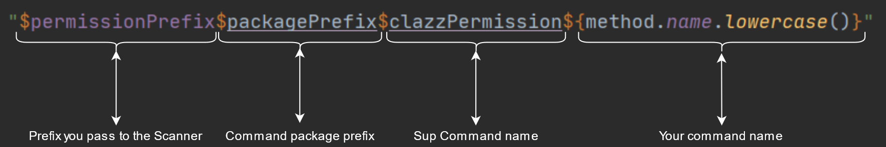

# Modern Kotlin Spigot Command Framework  
Were you always like why i have to code a lot of repeatable things  
No more i represent to you LupusCommandFramework  

Framework that will care about developers and will be powered by developers  

Here have a look  
```kotlin
class CommandFramework : JavaPlugin() {
	override fun onEnable() {
        val yourPathToCommands = "org.lupus.commands"
		Scanner(this).scan(yourPathToCommands)
	}
}
```
All you have to do to start coding commands  
The yourPathToCommands you just write down the package name of your command package folder  

Now for the command class  
```kotlin
package org.lupus.commands

import org.bukkit.entity.Player

class AdminCMD {
    fun test(executor: Player): String {
        return "Hello world"
    }
}
```
Yes thats all you need to do just write code  
The command above will just print out to player executor hello world  

Want command sender just change it out no problem  

No more plugin.yml no more annotations  
Did I forgot to add permission tree automatically generate for you?  
Tree generates with syntax represented below  
  <br/><br/>

## Command Package prefix
For example you have command in `org.lupus.commands.admin.badcmds.KickCMD` all of your commands sit in package `org.lupus.commands` your command package prefix will be then `pluginName.badcmds.admin.`<br/><br/>

## Sup Command name <br/>
Its just superior command name lets start with the same example i gave in the previous line